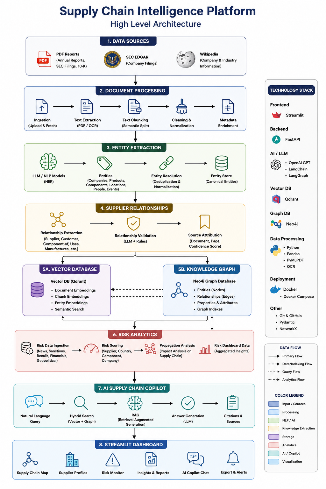

# Supply-Chain-Intelligence-Platform
AI-powered Supply Chain Mapping, Knowledge Graph, Risk Analytics &amp; RAG for Electronics Manufacturing.



### Core Architecture

```
Supply-Chain-Intelligence-Platform/
├── app/
│   ├── __init__.py
│   ├── constants.py              # Shared constants
│   ├── api/
│   │   └── main.py              # FastAPI application
│   ├── analytics/               # Graph analytics modules
│   │   ├── community_report.py
│   │   ├── country_dependency.py
│   │   ├── graph_analytics.py   # Centrality, community detection
│   │   ├── risk_score_engine.py # Risk calculation
│   │   ├── supplier_dependency.py
│   │   └── tier_analysis.py      # Tier-1/Tier-2 analysis
│   ├── chat/
│   │   └── question_router.py   # Routes user questions
│   ├── chunking/
│   │   ├── chunk_pipeline.py
│   │   ├── chunk_utils.py
│   │   └── chunker.py           # Semantic text chunking
│   ├── config/
│   │   └── settings.py           # Configuration management
│   ├── dashboard/
│   │   ├── dashboard_data.py
│   │   ├── dashboard_queries.py
│   │   ├── graph_dashboard.py    # Streamlit dashboard
│   │   ├── risk_dashboard_backend.py
│   ├── embeddings/
│   │   ├── embedding_generator.py
│   │   ├── embedding_pipeline.py
│   │   ├── embeddings.py
│   │   ├── qdrant_manager.py     # Vector store manager
│   │   └── search.py
│   ├── extraction/
│   │   ├── entity_extractor.py   # NER extraction
│   │   ├── entity_resolver.py    # Deduplication
│   │   ├── extraction_pipeline.py
│   │   ├── patterns.py           # Entity patterns
│   │   ├── relationship_extractor.py
│   │   └── relationship_patterns.py
│   ├── graph/
│   │   ├── graph_builder.py
│   │   ├── graph_pipeline.py
│   │   ├── neo4j_client.py
│   │   ├── neo4j_driver.py
│   │   └── neo4j_manager.py      # Neo4j operations
│   ├── ingestion/
│   │   ├── document_loader.py
│   │   └── pdf_loader.py
│   ├── models/                   # Data models
│   │   ├── chunk.py
│   │   ├── document.py
│   │   ├── entity.py
│   │   ├── processed_document.py
│   │   └── relationship.py
│   ├── preprocessing/
│   │   ├── document_processor.py
│   │   ├── processor_pipeline.py
│   │   └── text_cleaner.py
│   ├── rag/                      # RAG pipeline
│   │   ├── llm.py               # OpenAI integration
│   │   ├── prompts.py
│   │   ├── rag_pipeline.py
│   │   └── retriever.py
│   └── utils/
│       ├── file_utils.py
│       ├── helpers.py
│       └── logger.py
├── scripts/                       # Executable pipeline scripts
│   ├── generate_metadata.py
│   ├── run_chunking.py
│   ├── run_community_report.py
│   ├── run_country_dependency.py
│   ├── run_embeddings.py
│   ├── run_extraction.py
│   ├── run_graph_analytics.py
│   ├── run_graph_dashboard.py
│   ├── run_graph_pipeline.py
│   ├── run_llm.py
│   ├── run_preprocessing.py
│   ├── run_prompt.py
│   ├── run_question_router.py
│   ├── run_relationship_extraction.py
│   ├── run_retriever.py
│   ├── run_risk_dashboard_backend.py
│   ├── run_risk_scoring.py
│   ├── run_risk_score_engine.py
│   ├── run_supplier_dependency.py
│   ├── run_tier_analysis.py
├── tests/                         # Unit tests
│   ├── test_chunker.py
│   ├── test_country_dependency.py
│   ├── test_document_processor.py
│   ├── test_embeddings.py
│   ├── test_entity_extractor.py
│   ├── test_file_utils.py
│   ├── test_helpers.py
│   ├── test_llm.py
│   ├── test_logger.py
│   ├── test_risk_score_engine.py
│   └── test_tier_analysis.py
├── data/
│   ├── raw/                      # Source documents
│   │   ├── annual_reports/
│   │   ├── company_profiles/
│   │   ├── metadata/
│   │   └── wikipedia/
│   └── processed/               # Pipeline outputs
├── requirements.txt
├── pyproject.toml
├── README.md
├── notepad.txt                   # Quick reference for running pipelines
└── pytest.ini (missing - should exist)

```

### Data Pipeline Flow

```


Raw Documents (PDF)
       │
       ▼
┌─────────────────────┐
│  1. Preprocessing   │  → python -m scripts.run_preprocessing
│  (text extraction)  │
└─────────────────────┘
       │
       ▼
┌─────────────────────┐
│  2. Chunking        │  → python -m scripts.run_chunking
│  (semantic splits)  │
└─────────────────────┘
       │
       ▼
┌─────────────────────┐
│  3. Embeddings      │  → python -m scripts.run_embeddings
│  (Qdrant upload)    │
└─────────────────────┘
       │
       ▼
┌─────────────────────┐
│  4. Extraction      │  → python -m scripts.run_extraction
│  (NER + relations)  │
└─────────────────────┘
       │
       ▼
┌─────────────────────┐
│  5. Graph Import    │  → python -m scripts.run_graph_pipeline
│  (Neo4j nodes/rels)│
└─────────────────────┘
       │
       ▼
┌─────────────────────┐
│  6. Analytics       │  → python -m scripts.run_graph_analytics
│  (centrality, etc.) │  → python -m scripts.run_risk_scoring
└─────────────────────┘
       │
       ▼
┌─────────────────────┐
│  7. Dashboard       │  → python -m scripts.run_graph_dashboard
│  (Streamlit)        │
└─────────────────────┘
```